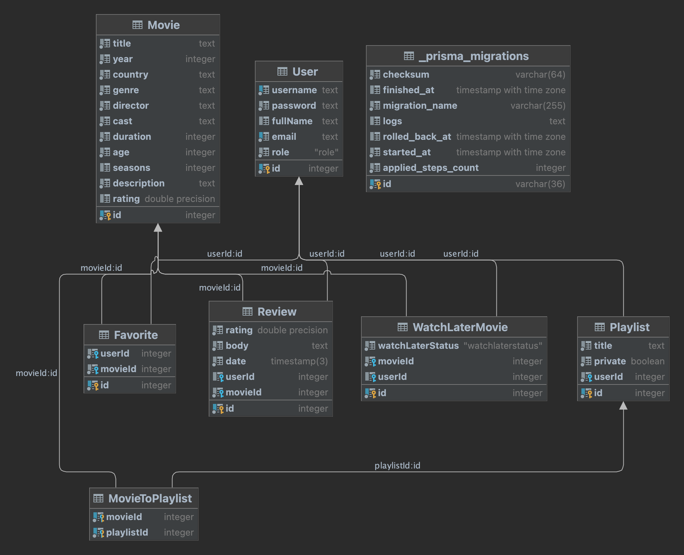

Moviecatalog (M33011 Sergeev Egor Dmitrievich)
============

Convenient service to store and share films

Introduction
-------------
This project was inspired by personal need to store and sort 
film I want to watch or remember.

If you use notes, paper or anything else to keep track of 
film, this website it the perfect choice to check out.

Content
------------
<u>The main functions planned to be added</u>:
1) Creating your own lists with films
2) Sharing lists
3) Browsing lists or film reviews of other users
4) Effective recommendation system
5) FIlm profile pages with general information about ones

<u>Quality of Life functions</u>:
1. Theme setting (light or dark)
2. Language (english or russian)
3. Website has account system. Personal data can be 
accessible on different devices

Visuals:
-------
#### Home page:

Database:
-------

### User
- id
- username – unique
- password
- full name
- email – unique
- role – type Role (below)

#### Role (enumeration)
- ADMIN
- USER

### Movie
- id
- title
- year – year of release
- country – country of production
- genre – list of genres
- director
- cast
- duration – in minutes
- age – age restriction
- seasons – number of seasons (nullable)
- description – string
- rating – float

### Playlist
- id
- title
- private – boolean
- userId – owner of the playlist

### Review
- id
- rating – float
- body – string
- date – DateTime of creation
- userId – author of the review
- movieId – movie which the review was written to

### WatchLaterMovie
- id
- watchLaterStatus – type WatchLaterStatus (below)
- movieId – movie to watch later
- userId – owner of the object

#### WatchLaterStatus
- WATCHED
- NOT_WATCHED

### _MovieToUser (favorites)
User has favorites. It is an array of movies. 
This many-to-many relation is responsible for this.

### _MovieToPlaylists (many-to-many relation)
This many-to-many relations is responsible for movies 
occurrences in multiple playlists.

Contacts:
--------
[My telegram](https://t.me/GTEgorss)

<noartu@mail.ru>
